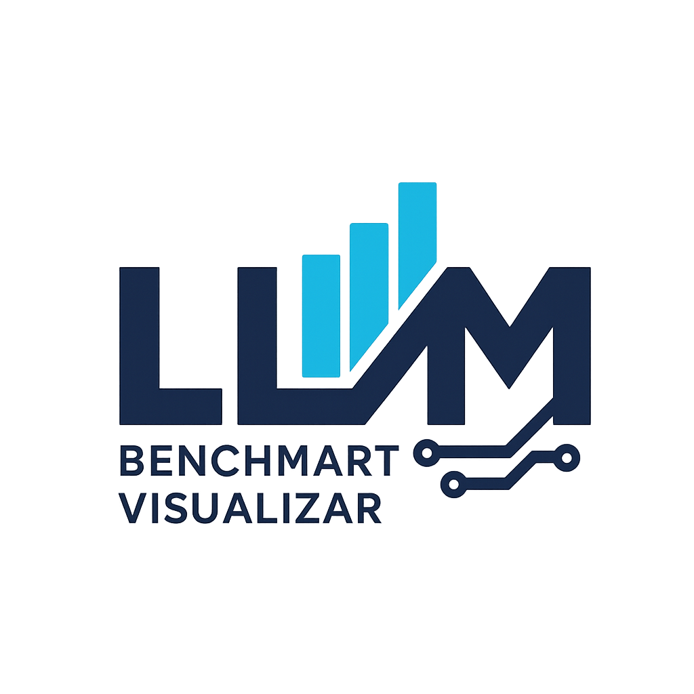
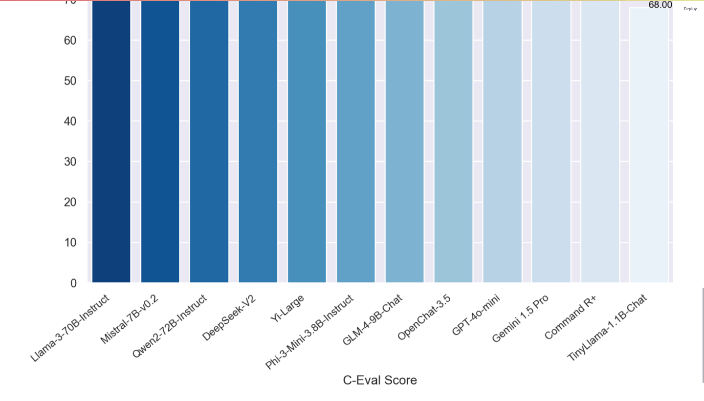

# LLM Benchmark Visualizer

<p align="center">

</p>

          


## ❔Overview

APAC LLM Dashboard transforms raw benchmark scores for Large‑Language Models originating in Asia–Pacific into a polished, browser‑based analytics experience. A lightweight Python ETL pipeline (powered by Google Gemini CLI) fetches the latest public scores and writes scores.csv. A Streamlit front‑end then renders interactive charts, filters, and data‑quality badges — no Java runtime needed.

Built to showcase data‑engineering and product‑ready UI in a single repo, the dashboard helps researchers, PMs, and recruiters compare TinyLlama, OpenChat, Cohere Command R+, and emerging regional models in seconds.


## 👀 Demo

🎬 [Watch the demo]()


### ✨ Open Bench Radar Screenshots

<p align="center">

</p>
<p align="center">

</p>
<p align="center">

</p>


#### System Requirements

> Both MacOS and Windows supported.


## Code

### 🛠️ Environment Setup

```bash
# Clone the repo
git clone https://github.com/dave21-py/llm-benchmark-visualizer.git
cd llm-benchmark-visualizer

# Python virtual environment
python3 -m venv venv
source venv/bin/activate        # Windows: venv\Scripts\activate
pip install -r requirements.txt

# Build the data (optional – CI refreshes it nightly)
python etl.py   # writes scores.csv

# Launch the dashboard
streamlit run app.py

```

## ✨ Credits

> + David Geddam [github.com](https://github.com/dave21-py)


## 🚀 Citation

If you find our work useful, please consider citing:

```
@software{geddam2025apacllmdashboard,
  title  = {Open Bench Radar},
  author = {David Geddam},
  year   = {2025},
  url    = {https://github.com/dave21-py/llm-benchmark-visualizer.git}
}
```

## 📭 Contact

For any questions, please raise a concern or contact us at
+ David Geddam [linkedin.com](https://www.linkedin.com/in/david-geddam/)
